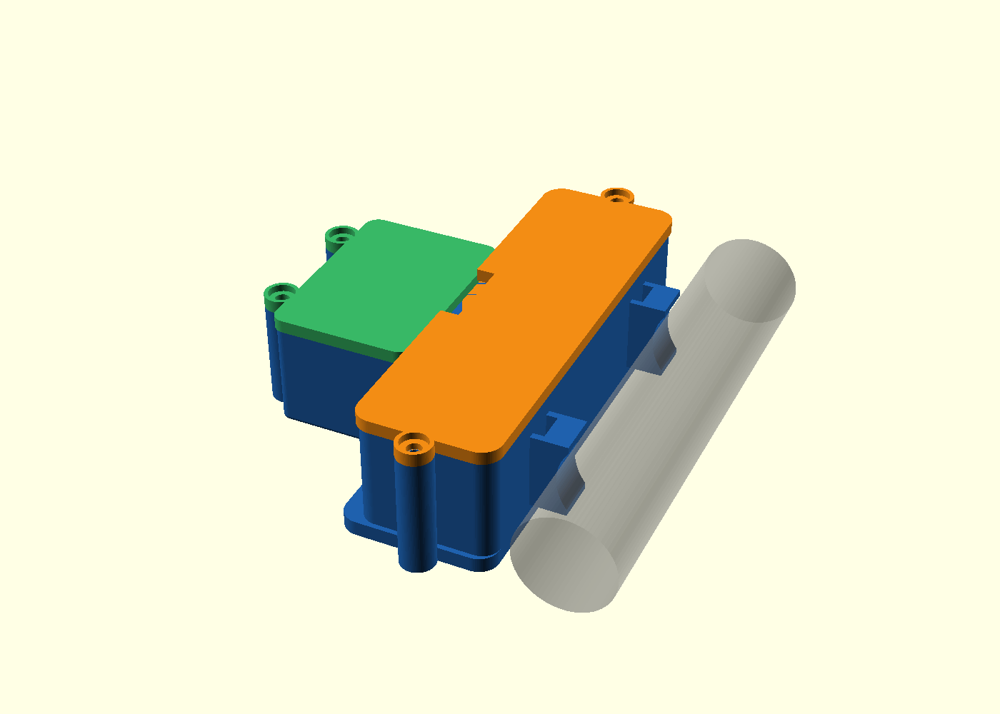
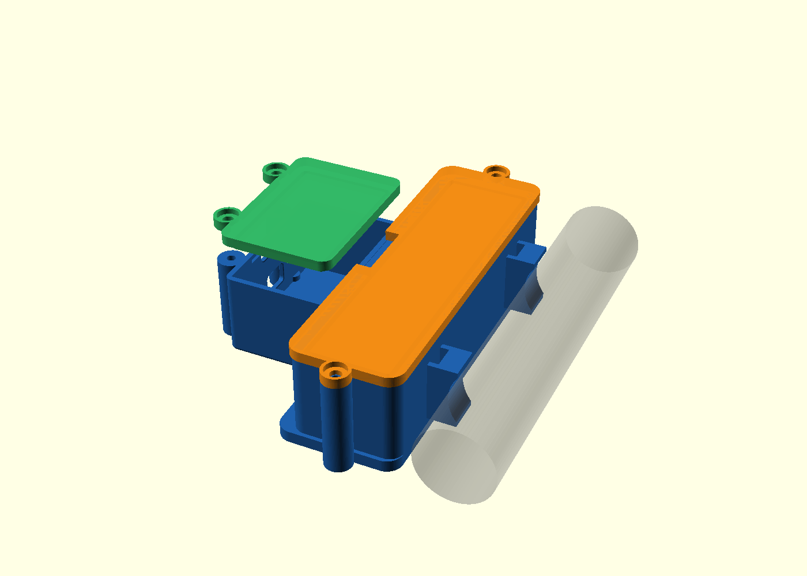

# 🚴 ErgoBike BLE - Adaptador Bluetooth Smart para Bike Ergométrica

<p align="center">
  
</p>

<p align="center">
  
  
  
  
  
</p>

---

Transforme sua bicicleta ergométrica convencional com medidor de pulso simples (cabo P1/P2) em um **Smart Indoor Trainer Bluetooth** completo e de alta precisão, compatível nativamente com o **CycleGo**, **Zwift**, **MyWhoosh**, **Kinomap**, **Wahoo Fitness**, **Rouvy**, **Strava** e outros aplicativos de treino indoor.

Desenvolvido para **ESP32-C3** (RISC-V) alimentado por uma bateria **18650**, com consumo ultra-baixo em repouso (**Deep Sleep < 15 µA**), despertar automático ao primeiro giro do pedal e um **Portal Wi-Fi de Auto-Calibração** sem necessidade de abrir a carenagem da bike.

---

## 🌟 Principais Recursos

- **Dual-Stack BLE Oficial (CSCS + FTMS + BAS):**
  - **CSCS (Cycling Speed and Cadence Service - `0x1816`):** Padrão universal para cadência e velocidade com base de tempo de 1/1024s, SC Control Point (`0x2A55`) e localização do sensor.
  - **FTMS (Fitness Machine Service - `0x1826`):** Padrão moderno de *Indoor Bike Data* (`0x2AD2`) com velocidade, cadência, potência estimada (Watts), Status (`0x2ADA`) e Control Point (`0x2AD9`).
  - **Battery Service (`0x180F`):** Monitoramento contínuo da porcentagem da célula 18650 diretamente no app.
- **Assistente de Auto-Calibração (10 Voltas no Pedal):**
  - Calibração guiada via navegador: dê 10 voltas no pedal e o sistema calcula a relação de polia da roda de inércia automaticamente.
- **Gestão Inteligente de Energia (Deep Sleep):**
  - Desliga automaticamente após 3 minutos de inatividade.
  - Desperta instantaneamente no primeiro pulso do ímã (GPIO 21 interrupt wake).
- **Portal Web Wi-Fi Responsivo + Atualização OTA:**
  - Dashboard ao vivo com velocímetro, cadência e nível de bateria.
  - Atualização de firmware sem fios (Over-The-Air) pelo celular ou notebook.
- **Enclosure 3D V9 Sob Medida:**
  - Compartimento dedicado para ESP32-C3 + suporte para bateria 18650 com tampas parafusadas e abraçadeira para tubo de 20 mm.

---

## 📱 Compatibilidade de Aplicativos

| Aplicativo | Protocolo BLE Utilizado | Métricas Suportadas |
| :--- | :--- | :--- |
| **CycleGo** | CSCS / FTMS | Cadência (RPM) e Velocidade (km/h) |
| **Zwift** | FTMS / CSCS | Cadência, Velocidade, Potência Estimada e Bateria |
| **MyWhoosh** | FTMS / CSCS | Cadência, Velocidade e Potência Estimada |
| **Kinomap** | FTMS / CSCS | Cadência, Velocidade e Potência Estimada |
| **Wahoo Fitness** | CSCS | Cadência, Velocidade e Bateria |
| **Rouvy** | CSCS | Cadência e Velocidade Virtual |
| **Strava** (Gravação) | CSCS | Cadência e Velocidade do Treino |
| **nRF Connect** | CSCS + FTMS + BAS + DIS | Diagnóstico completo de GATT |

---

## 🛠️ Esquema Elétrico e Conexões

### Opção A: Placa de Expansão ESP32-C3 SuperMini (AliExpress) — *Recomendado*

A placa de expansão para ESP32-C3 SuperMini simplifica a montagem física:
- **Porta de Bateria PH2.0 integrada:** basta plugar a bateria 3.7V (18650 ou LiPo com conector PH2.0).
- **Carregador de Bateria Onboard (LTC4054/LTH7R):** recarrega a bateria diretamente pela porta USB-C da placa com LED indicador de carga (Verde aceso = carregando, apagado = carregado/uso).
- **Barramentos G-V-S (Ground, VCC, Signal):** facilitam o encaixe com conectores fêmea dupont.

```
                  Placa de Expansão ESP32-C3 SuperMini
                  +-----------------------------------+
[ BATERIA 3.7V ]  | [ Conector PH2.0 "BAT" ]          |
Célula 18650 ---->| (Carregador Onboard + Regulador)  |
                  |                                   |
[ JACK P2 BIKE ]  | Barramento GPIO 21 (G - V - S)    |
Ponta (Sinal) ------------------------------------> (S - Amarelo) GPIO 21 (INPUT_PULLUP)
Malha (GND)   ------------------------------------> (G - Preto)   GND
                                                   [V - Vermelho] VAZIO (NÃO LIGAR)
                  |                                   |
[ BOTÃO BOOT ]    | Integrado no ESP32-C3 SuperMini   | (GPIO 9 - Segure 2s para Wi-Fi)
[ LED STATUS ]    | Integrado no ESP32-C3 SuperMini   | (GPIO 8 - Onboard Blue LED)
                  +-----------------------------------+

* Nota sobre Monitoramento de Bateria:
- A placa de expansão alimenta o ESP32-C3 via regulador 3.3V integrado.
- Modo Padrão Automático: Se não conectar divisor externo no GPIO 0, o firmware detecta
  alimentação direta via porta BAT e opera continuamente sem falso alerta de bateria fraca.
- (Opcional) Medição Precisa em Volts: Conecte um divisor 100k/100k entre o terminal positivo (BAT+)
  da bateria e o GND, com o ponto central ligado ao pino (S) do GPIO 0.
```

### Opção B: Montagem Avulsa / DevKitM-1 Tradicional

```
                       ESP32-C3
                   +---------------+
[ JACK P2 DA BIKE ]|               |
Ponta (Sinal) ---------------------| GPIO 21 (INPUT_PULLUP + WAKEUP)
Malha (GND)   -----+---------------| GND
                   |               |
[ BATERIA 18650 ]  |               |
Polo (+) ----------[ 100kΩ ]---+---| GPIO 0 (ADC1_CH0)
                               |   |
                           [ 100kΩ ]
                               |   |
Polo (-) ----------------------+---| GND
                                   |
[ BOTÃO SETUP ]--------------------| GPIO 9 (Nativo BOOT - Segure 2s para Wi-Fi)
[ LED STATUS ]---------------------| GPIO 8 (Ativo em nível LOW)
                   +---------------+
```

### Lista de Componentes Eletrônicos:
1. **Microcontrolador:** Placa ESP32-C3 SuperMini + **Placa de Expansão ESP32-C3 SuperMini** (AliExpress).
2. **Bateria:** Célula 18650 3.7V Li-ion (ou bateria LiPo) com conector JST PH 2.0mm.
3. **Conector do Sensor:** Conector Jack P2 (3.5 mm) ou P1 (2.5 mm) fêmea/macho.
4. **Resistor de Proteção:** 1x Resistor 1kΩ (ligado em série no pino de sinal para proteção ESD).
5. *(Opcional)* **2x Resistores 100kΩ:** apenas se desejar leitura analógica contínua da tensão da bateria no GPIO 0.

---

## 🖨️ Enclosure 3D (V9)

Os modelos 3D paramétricos estão disponíveis na pasta [`hardware/3d_models/`](hardware/3d_models/):

<p align="center">
  
</p>

* **Corpo Principal:** `ESP32C3_18650_Body_V9_ESP_ScrewLid.stl`
* **Tampa da Bateria:** `ESP32C3_18650_Battery_Lid_V9.stl`
* **Tampa do ESP32:** `ESP32C3_Lid_V9_2Screws.stl`
* **Parafusos recomendados:** 4x parafusos autoatarraxantes M2.5 x 8 mm para plástico.
* **Fixação na Bike:** Encaixe para tubo de 20 mm com ranhuras para abraçadeiras de nylon (*enforca-gato*).

> ⚠️ **Status de Compatibilidade Parcial & Via de Contribuição:**<br>
> O modelo 3D atual (V9) é funcional, porém possui **compatibilidade parcial**, pois foi modelado com base em um tubo de fixação específico (~20 mm) e dimensões de componentes particulares. Dependendo do diâmetro do tubo da sua ergométrica, do tipo de conector P2/P1 ou do holder de bateria utilizado, podem ser necessários ajustes.<br>
> **Melhorias e variantes 3D são uma das principais vias de contribuição para este projeto!** Se você desenvolver novos suportes, cases para outros diâmetros de quadro, presilhas ou modelos em STEP/OpenSCAD, envie seu Pull Request!

---

## 🚀 Compilação e Gravação

### Ambientes Disponíveis (PlatformIO)
* **`esp32-c3` (Padrão de Produção):** Perfil Dual completo com **CSCS** (`0x1816` + `0x2A55`), **FTMS** (`0x1826` com potência estimada, Status e Control Point) e **Battery Service** (`0x180F`).
* **`esp32-c3-ftms-only`:** Perfil isolado FTMS para diagnósticos específicos em simuladores que exigem exclusivamente FTMS.

### Usando PlatformIO (Linha de Comando ou VS Code)
1. Clone este repositório:
   ```bash
   git clone https://github.com/lorenzo-br/ergobike-ble.git
   cd ergobike-ble
   ```
2. Compile e grave o ambiente padrão:
   ```bash
   pio run -e esp32-c3 -t upload
   ```
3. (Opcional) Execute todos os testes unitários nativos de mesa:
   ```bash
   pio test -e native
   ```

### Usando Arduino IDE
1. Adicione a URL do ESP32 em *Arquivo > Preferências*:
   `https://espressif.github.io/arduino-esp32/package_esp32_index.json`
2. Instale as bibliotecas via Gerenciador de Bibliotecas:
   - `NimBLE-Arduino`
   - `ArduinoJson`
   - `ESPAsyncWebServer` e `AsyncTCP`
3. Selecione a placa **ESP32C3 Dev Module** e realize o upload.

---

## 📱 Guia de Uso e Calibração

### 1. Calibração Inicial sem Fio (Modo Wi-Fi)
1. Ligue o dispositivo segurando o **botão BOOT (GPIO 9)** por 2 a 3 segundos.
2. O LED de status começará a **piscar rapidamente**.
3. No smartphone ou computador, conecte na rede Wi-Fi:
   - **Nome da Rede (SSID):** `ErgoBike-Setup`
   - **Senha:** `12345678`
4. Abra o navegador em `http://192.168.4.1`.
5. Na seção **Assistente de Auto-Calibração**:
   - Clique em **"1. Iniciar Contagem"**.
   - Dê exatamente **10 voltas completas** no pedal da bike.
   - Clique em **"2. Concluir Calibração"**.
   - O sistema salvará a relação calculada diretamente na memória Flash (NVS)!
6. Clique em **"Reiniciar em Modo BLE"**.

---

### 2. Conexão no **CycleGo**
1. Abra o aplicativo **CycleGo** (iOS / Android).
2. Acesse a tela de conexão de sensores.
3. Conecte o sensor chamado **`ErgoBike-BLE`**.
4. Pronto! Ao pedalar, suas métricas de cadência e velocidade virtual responderão instantaneamente.

---

## 🧪 Testes Unitários de Algoritmo

O projeto inclui suíte de testes de mesa em C++17 para validação das fórmulas matemáticas, filtros de debounce e curva da bateria:

```bash
# Executar testes unitários nativos (MSVC / GCC / Clang)
cl /EHsc /std:c++17 /DNATIVE_TEST /Iinclude src\sensor_reader.cpp test\test_sensor_math.cpp /Fe:test_sensor.exe && test_sensor.exe
cl /EHsc /std:c++17 /DNATIVE_TEST /Iinclude src\battery_monitor.cpp test\test_battery_math.cpp /Fe:test_battery.exe && test_battery.exe
```

---

## 📁 Estrutura de Arquivos

```
ergobike_ble/
├── hardware/
│   └── 3d_models/           # Arquivos STL, OpenSCAD e imagens do Case V9
├── include/
│   ├── config.h             # Pinos, parâmetros e UUIDs dos serviços BLE
│   ├── sensor_reader.h      # Processamento de pulso, debounce e métricas
│   ├── ble_manager.h        # Servidor BLE (CSCS, FTMS, Battery Service)
│   ├── csc_control_point.h  # Protocolo e respostas do CSC Control Point (0x2A55)
│   ├── ftms_control_point.h # Protocolo e respostas do FTMS Control Point (0x2AD9)
│   ├── ftms_indoor_bike_data.h # Empacotamento FTMS e estimador de potência
│   ├── storage_manager.h    # Persistência de parâmetros e migração Flash NVS
│   ├── battery_monitor.h    # Leitura de ADC e curva percentual da 18650
│   ├── power_manager.h      # Inatividade e controle de Deep Sleep
│   ├── web_assets.h         # Single-Page Web App embarcada
│   └── web_portal.h         # Servidor Web, Captive DNS e OTA Updater
├── src/
│   ├── main.cpp             # Orquestrador e máquina de estados principal
│   ├── sensor_reader.cpp
│   ├── ble_manager.cpp
│   ├── storage_manager.cpp
│   ├── battery_monitor.cpp
│   ├── power_manager.cpp
│   └── web_portal.cpp
├── test/                    # Suíte completa de testes unitários nativos (7 casos)
│   ├── test_sensor_math.cpp
│   ├── test_battery_math.cpp
│   ├── test_ble_profile.cpp
│   ├── test_ftms_control_point.cpp
│   ├── test_ftms_indoor_bike_data.cpp
│   ├── test_csc_control_point.cpp
│   └── test_config_defaults.cpp
├── platformio.ini           # Ambientes esp32-c3, esp32-c3-ftms-only e native
├── min_spiffs.csv           # Tabela de partições (Flash OTA 4MB)
├── LICENSE                  # Licença MIT
└── README.md
```

---

## 🤝 Como Contribuir

Contribuições de toda a comunidade ciclista e maker são muito bem-vindas! Algumas formas diretas de colaborar:

1. **Modelagem 3D & Adaptações Mecânicas:**
   - Criar variantes do case para diferentes diâmetros de quadro de bicicleta (22 mm, 25 mm, tubos ovais, etc.).
   - Desenvolver suportes alternativos para outros tipos de baterias (14500, LiPo plana, holders com trava).
   - Disponibilizar arquivos em formatos universais (`STEP`, `F3D`, `FreeCAD`).
2. **Compatibilidade com Novos Aplicativos:**
   - Testar o sensor em outros apps de ciclismo indoor (GoldenCheetah, TrainerRoad, FulGaz, etc.) e reportar feedback nas *Issues*.
3. **Firmware & Recursos:**
   - Abrir *Pull Requests* com testes unitários adicionais, otimizações de consumo de energia ou refinamentos na estimativa de potência.

---

## 📄 Licença

Este projeto é disponibilizado sob a licença **MIT**. Consulte o arquivo [LICENSE](LICENSE) para mais detalhes. Sinta-se livre para usar, modificar e compartilhar.
